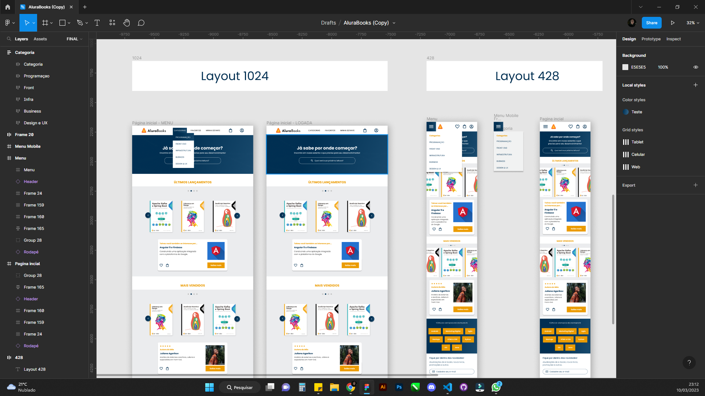

<h1 align="center"> Projeto Alura Books</h1>

Este é o 3º projeto desenvolvido que faz parte da Formação Front End da Platafroma Alura, apresentado por Guilherme Lima, Rafaella Ballerini e Monica Hillman. 

  <a href="#-tecnologias">Tecnologias</a>&nbsp;&nbsp;&nbsp;|&nbsp;&nbsp;&nbsp;
  <a href="#-projeto">Projeto</a>&nbsp;&nbsp;&nbsp;|&nbsp;&nbsp;&nbsp;
  <a href="#-layout">Layout</a>&nbsp;&nbsp;&nbsp;|&nbsp;&nbsp;&nbsp;
  <a href="#memo-licença">Licença</a>

  

 

  

    
  

 
 

 
